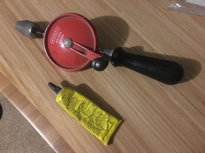
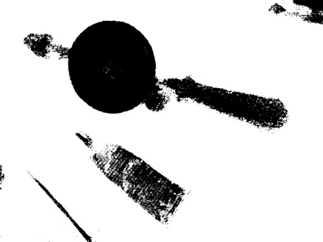
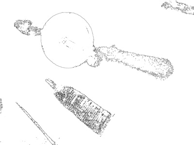
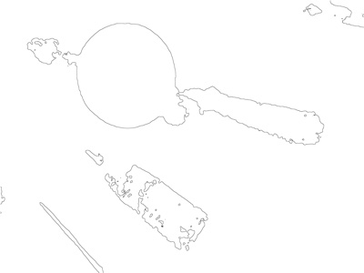

# AE0732 Programming Excercise

This excercise implements both a class with the methods given in the project definition and a command line driver to excercise the methods with test images.

## Class ImageAnalysisService

1. FIND_REGION accepts an RGB image, an (X, Y) pixel location, and a distance parameter to
control a greedy style algorithm that "flood fills" the nearby pixels in order to find
a contiguous patch of pixels that are similar in color. The return value is a vector of
cv::Points. The RGB image is converted to HSV to easily select by color (H). The maximum
distance from the color at point x,y is given as a parameter. The hue at the x,y point
is optionally returned in the "*hue" argument.

2. FIND_PERIMETER accepts the output of FIND_REGION and outputs contiguous pixels that border the region. These pixels are a subset of pixels returned by FIND_REGION.

3. FIND_SMOOTH_PERIMETER accepts the output of FIND_REGION and outputs contiguous pixels that border the region. These pixels are a subset of pixels returned by FIND_REGION. The perimeter values are smoothed to remove jagged contours, small artifacts. Smoothing:

 - removes jagged contours, small artifacts, etc.
 
 - remains generally close to the non-smoothed original boundary
 
 - potentially  expressed via a lower degree parametric representation of the smoothed perimeter, such as splines or bezier curves.

A number of smoothing options are available, as defined in the smoothing_type enum as:  "Blur, MedianBlur, GuassianBlur, BilateralFilter".

4. DISPLAY_IMAGE provides a method for displaying loaded RGB images.

5. DISPLAY_PIXELS displays an image representation of the results from the above FIND_* operators in a region point vector.

6. SAVE_PIXELS accepts the region output saves as an image to a file.

7. SAVE_IMAGE saves and image to a named file.

## Test Driver

The test driver in main.cpp accept as arguments, the image file path, and output file path, x,y coordinates in the image from which the initial hue value is taken and a distance (arbitraary hue values from 0 to 255) in hue from which the point value willl be accepted in the region.

## Build

cd to directory

cmake .

make

## Run Example

./ImageAnalysisService AeolusTestImages/test1.png 10 20

Smoothing:

./ImageAnalysisService AeolusTestImages/test3.png 100 100
./ImageAnalysisService AeolusTestImages/test4.jpg 2200 600

To run all test cases:

./run.sh

## Sample Results

| Original Image | Region Image |
|:-------------:|:-------------:|
|  |  |
| Perimeter | Smoothed |
|  |  |

## TODO

- add exceptions
- fix bugs 
  

